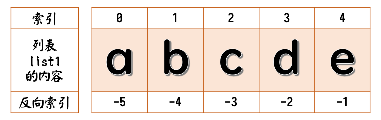

[<<主目录](https://www.unitalk.fun/unitalk/public/d/55-python)

[何不学Python：五、编程基本结构之分支结构](https://www.unitalk.fun/unitalk/public/d/108-python)
在上一章中，我们介绍了分支结构。

在介绍循环结构之前，我们先花费一个比较长的章节来介绍一些，类似于“数组”的数据类型。
由于本章讲解这些数据类型的操作，所以推荐使用**IDLE**来帮助加深对这些数据类型的印象。

___

### 为什么本章这么长？

因为这些数据结构很重要。在下一个章节中，我们也要依赖这些数据结构。

很多对编程稍微有那么一丁点儿了解的童鞋，都应该听说过“数组（`Array`）”。
将一个个“元素”有序地排列起来，就组成了“数组”。

Python中没有数组，但是有很多类似的数据结构，包括：“列表（`List`）”、“元组（`Tuple`）”、“字典（`Dict`）”、“集合（`Set`）”。
这些数据结构非常灵活，并且有很多“操作”，即“内置函数”或者说“方法”。

由于“列表”最基本以及它能做的操作几乎是最多的，所以我们先从它以及它可以进行的操作说起。

___

### 像极了数组的“列表”

Python中的“列表”，它与我们所知道的“数组”，是非常相似的。
请看Python中的列表是什么样子：
```Python
[]                      # 这是一个空列表
[1, 2, 3]               # 这两个列表最最常见的形式
['a', 'b', 'c']
[1, 'b', ["1654", 3072, 2020 - 1024], False]   # 这是混合列表
```

请特别注意一下混合列表。Python中可以将不同的数据类型放在一个列表中。

但是为什么？

Python里有句话是“Everything is object”，意为在Python中，所有东西都是对象。
_^（注：其实JavaScript里也有这句话，意思也一样。）^_
虽然在你的眼里，`1`是数字或者说整数，`'b'`是一个字符，`[]`是一个列表……
但对于面向对象的Python眼里，`1`是对象，`'b'`是对象，`[]`也是对象，列表中所有的元素一个一个的都是对象，列表本身也是一个对象。
列表的本质即，将你指定的对象，有序地排列起来。

如果你将你的常量、变量、函数等，都当成是“东西”，可能会让你对Python的了解更容易一些。关于类与对象，将在之后的章节详细讲解。

在处理一串稍微复杂的数据时，考虑适当使用混合列表，将会对程序的思路和编写产生很大帮助。

___

### 列表的操作

我们先假设创建一个，含有三个整数的叫做`list1`的列表变量：
```Python
list1 = ["a", "b", "c", "d", "e"]
```
内容有点多，请让我逐一为你介绍这些操作：

* #### 获取列表的长度
  使用`len()`函数即可获得列表的长度。即列表有多少元素。
  ```Python
  len(list1)      # 本例中将获得整数 5
  ```

* #### 列表元素的访问
  要访问列表中的某个元素，在列表名字后面加方括号，里面写上该元素的“索引（`Index`）”，意即该元素的位置，或者说编号。对于本例子请参考这张图。
  
  [color=yellow]**⚠请特别注意：**[/color]计算机在数数的时候，一般是**从零（0）开始**的。
  ```Python
  list1[0]        # 访问首个元素
  list1[1]        # 访问第二个元素
  ```
  反向索引，即从列表的最末端开始数。
  请参照图像，使用负数的索引：
  ```Python
  list1[-1]       # 访问最后一个元素
  list2[-2]       # 访问倒数第二个元素
  ```
  [color=red]**❌请小心错误：**[/color]如果你使用超出了列表长度的索引，由于你指定的元素并不存在，会引发索引错误（`IndexError`）。

* #### 获取列表切片
  “切片”即，获取列表的切出来的的一段。这切出来的一段的数据类型与源相同，这里是列表。
  可能有点难理解，请看下面的例子：
  ```Python
  list1[2:4]      # 从索引为2的元素开始，到索引为4的元素（不含）为止。
                  # 本例中获取到的是 ["c", "d"]
  
  list1[2:]       # 从索引为2的元素开始，一直到列表的末尾。
                  # 本例中获取到的是 ["c", "d", "e"]
  
  list1[:3]       # 从列表的开头，一直到索引为3的元素（不含）为止。
                  # 本例中获取到的是 ["a", "b", "c"]
  ```
  你也可以使用反向索引：
  ```Python
  list1[1:-2]     # 从索引为1的元素开始，一直到倒数第二个元素（不含）为止。
                  # 本例中获取到的是 ["b", "c"]
  ```
  切片的格式`list1[a:b]`，可以结合上面的图像，尝试通过以下两个角度理解：
  从计算机的角度：从索引为`a`的元素**前**切第一刀，从索引为`b`的元素**前**切第二刀，获得切片；
  从人数数的角度：从第`a`个元素**后**切第一刀，从第`b`个元素**后**切第二刀，获得切片。

* #### 获取列表的最大值与最小值
  使用`min()`函数与`max()`函数即可获取列表中最小和最大的元素。
  ```Python
  min(list1)      # 获取最小值，本例中为"a"
  max(list1)      # 获取最大值，本列中为"e"
  ```
  这两个函数的本质是通过小于号`<`和大于号`>`比较每个元素来获得最小与最大的元素。
  当列表的内容都是整数和浮点数，则会根据数字的大小来比较。
  当列表的内容都是字符串时，会根据从字符串中字符的Ascii值或者Unicode值来判断大小。每个字符串会从首字符开始进行比较。

  [color=yellow]**⚠请特别注意：**[/color]如果你需要比较带中文字符的列表，请注意在Unicode中，中文**并不是**以拼音或是笔画数排列的。
  [color=red]**❌请小心错误：**[/color]如果你使用了无法比较大小的数据类型，即Python还未定义如何比较的相同或不同的数据类型，会引发类型错误（`TypeError`）。

* #### 获取元素相关信息
  查找给定的元素首次出现的位置（索引），使用列表的`index()`方法。
  ```Python
  list1.index("c")  # 获取"c"这个元素的索引
                    # 本例中获取到的是 2
  ```
  获取列表中给定元素的个数，使用`count()`方法。
  ```Python
  list1.count("d")  # 获取"d"这个元素出现的次数
                    # 本例中获取到的是 1
  ```
  请注意这两个函数，这两个函数本身是列表对象的内置函数。在调用内置函数时，我们必须告诉计算机，我们要调用什么对象实体的哪个函数。
  我们称我们定义的列表`list1`为列表对象的一个**实体**。
  大多数面向对象的编程语言，使用`实体名.方法()`这样的格式，来调用方法。

* #### 列表元素的修改操作
  [color=yellow]**⚠注意：**[/color]以下操作将修改列表，尝试时请注意列表的内容。你随时可以使用之前提到的“`list1 = ["a", "b", "c", "d", "e"]`”来将`list1`恢复成例子初始的列表。

  * ##### 变更
    使用赋值运算符`=`来修改列表的元素，或者列表本身。
    ```Python
    list1[0] = "f"      # 将第一个元素改成"f"
    list1 = 456         # 将列表内容舍弃掉，然后赋值一个整数
    ```
  
  * ##### 增加
    使用`append()`方法来向列表的末尾增加**一个**元素。
    ```Python
    list1.append("g")
    ```
    
    你可以使用`insert()`方法来向列表中插入**一个**元素。
    这个方法要求两个参数，第一个是要插入的索引，第二个是你要添加的元素。
    ```Python
    list1.insert(2 ,"h")   # 在索引为2的位置插入一个"h"
                           # 其它元素向后移
                           # 或者理解为，在第2个元素后插入"h"
    ```
    
    [color=yellow]**⚠请注意：**[/color]`append()`与`insert()`方法都是增加**一个**元素，即：就算你append或insert的是一个列表，这个列表也会被当作**一个**元素添加进去。

    如果你需要用另一个列表来扩展`list1`，你需要使用`extend()`方法，或者使用加法运算符`+`、加法并赋值运算符`+=`来扩展列表。
    ```Python
    list1.extend(["i", "j"])
    list1 += ["k", "l", "m"]
    ```
  
  * ##### 删除
    你还可以使用`pop()`方法来删除你指定的元素。只需要将索引提供给这个方法即可。如果没有参数，将会为你删除列表末尾的元素。
    ```Python
    list1.pop()         # 删除末尾的元素
    list1.pop(2)        # 删除索引为2的元素，即第三个元素
    ```
    注：`pop()`方法有返回值，它的返回值是被pop掉的元素。在某些场景中，你可以利用这一点。
    
    尽管不建议，但你还可以使用之前介绍过用来释放（删除）变量的`del`关键字。
    ```Python
    del list1[4]        # 删除索引为4的元素，即第五个元素
    ```
    `del`其实就是用来删除对象实体的关键字，请一定谨慎使用。
    
    除此之外，你还可以使用`remove()`方法，移除与你给的参数的相匹配的元素。如果列表中有多个相同的元素，那么移除的将是第一个匹配到的元素，即索引号最小的那个。
    ```Python
    list1.remove("e")
    ```
    
    你可以使用`clear()`方法，清空列表。
    [color=yellow]**⚠警告：**[/color]使用该方法，你的列表将变成一个**空列表**。
    ```Python
    list1.clear()
    ```
  
  * ##### 反转
    你可以使用`reverse()`方法来将你的列表倒过来，即反转你的列表。
    ```Python
    list1.reverse()
    ```
  
  * ##### 排序
    你可以使用`sort()`方法，对列表进行排序。
    ```Python
    list1.sort()
    ```
    `sort()`方法有两个必须使用名字传入的形参。
    一个是`key`，默认值`None`，传入你用来为排序制作的方法的函数的名字；
    一个是`reverse`，默认值`False`，指定你是否要反转排序后的列表。
    [color=red]**❌请小心错误：**[/color]如同`min()`函数一样，`sort()`使用小于号`<`来在排序时进行比较，请注意可能会引发的类型错误（`TypeError`）。

    那就先简单说下用`reverse`为你的列表排序并反转。
    它可以看作先后使用了无参数的`sort()`方法和`reverse()`方法。
    ```Python
    list1.sort(reverse = True)
    ```
    
    然后是`key`这个参数稍微有点复杂，它传入一个常常是由你来编写的，为你的元素排序时加权的函数。
    比如你可以编写一个用来实现根据长度排序的函数，返回值就是它的权重：
    ```Python
    def elem_len(elem):
        return len(elem)
    ```
    然后在你使用`sort()`方法时，为`key`指定这个函数的名字当参数。
    ```Python
    list1.sort(key = elem_len)
    ```
    Python会按你的要求对列表元素计算权重，并根据权重排序。
    
  * 


Unitalk 兼容性测试